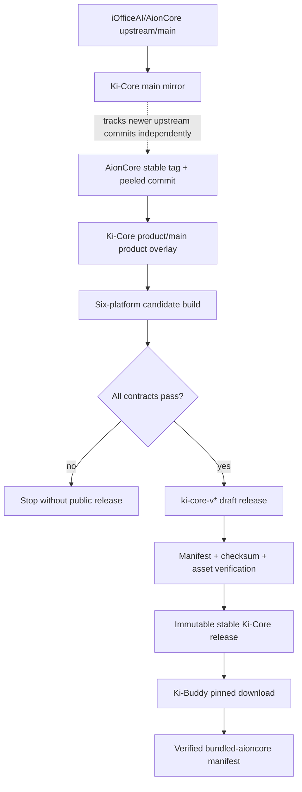
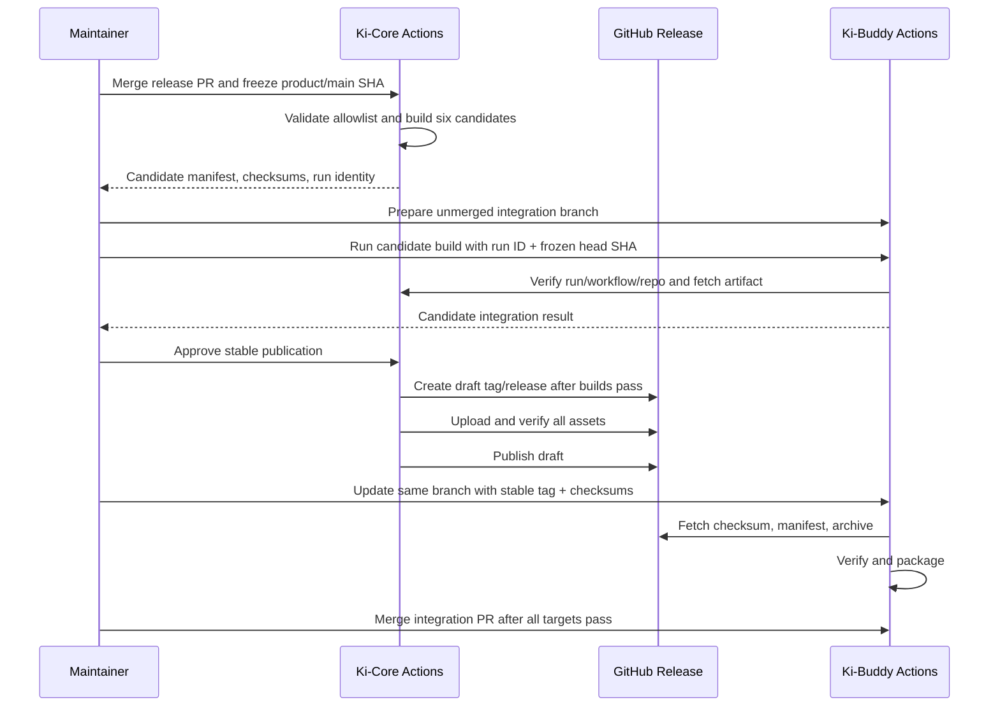

# Ki-Core Independent Release and Ki-Buddy Integration - Plan

> **已废弃（2026-08-06）**  
> 本计划保留为历史记录，不再作为实施或发版依据。Candidate Build 前置、复杂发布状态和多阶段资产发布要求已经被后续对齐方案替代。当前有效方案见[上游发版流程分析与 Ki 双仓目标流程](../contributing/upstream-release-analysis-and-target-alignment.zh-CN.md)，实际操作见[仓库管理者发版和维护手册](../contributing/maintainer-release-and-maintenance-handbook.zh-CN.md)。

## Goal Capsule

- **Objective:** 建立 Ki-Core 独立产品版本、上游版本映射、候选构建和稳定发布机制，并让 Ki-Buddy 固定、校验和记录该 Ki-Core 发布。
- **Repositories:** Ki-Core 负责上游基线、产品版本和二进制发布；Ki-Buddy 负责版本固定、下载校验和桌面产品打包。
- **Authority:** 本文中的 session-settled 决策优先于实现偏好；Product Contract 规定产品行为；Planning Contract 规定实现机制；两个仓库各自的贡献规范继续生效。
- **Execution profile:** 双仓代码改造加一次受控的 GitHub 稳定发布。Ki-Core 发布成功后才允许合并 Ki-Buddy 的稳定版本固定。
- **Stop conditions:** 上游 tag 与 commit 不一致、产品分支出现非允许的上游源码差异、六平台任一构建失败、release manifest 或 checksum 不一致、目标 tag/release 已公开存在，或发布审批与凭证未配置。
- **Tail ownership:** Ki-Core 发布流程拥有 tag、release 和资产完整性；Ki-Buddy 正式构建只消费不可变发布，不修改或替换 Ki-Core 资产。候选联调可按 R13 消费经过身份验证的 Ki-Core Actions artifact。

---

## Product Contract

### Summary

Ki-Core 作为独立产品维护自己的 SemVer、`ki-core-v*` tag、release archive、checksum 和发布历史。AionCore 的 Cargo workspace version、Rust 源码、API、协议和数据库迁移继续保持上游语义。Ki-Buddy 正式构建只依赖 Ki-Core 的产品发布，并从 Ki-Core 提供的机器可读 manifest 获得 AionCore 来源信息；候选联调按 R13 使用经过身份验证的 Ki-Core Actions artifact。

首阶段的主要使用方是 Ki-Buddy 的正式构建、发布维护者和开发者。公开 GitHub Release 是 Ki-Core 向 Ki-Buddy 提供二进制的分发渠道，不构成独立面向终端用户的 CLI 或 API 支持承诺。Ki-Core 在本计划中承诺的兼容面仅包括 tag 语法、六个平台与资产命名、archive 内部 executable 名称、release manifest/checksum schema 和 provenance 字段；AionCore 自身 CLI、API 与协议兼容性继续由上游定义。

### Problem Frame

现有 Ki-Core release-please 配置会修改 `Cargo.toml` 和 `Cargo.lock`，并使用 AionCore 的裸 `v*` tag 与资产名称。现有 Ki-Buddy 下载器又把仓库、tag、archive 和 Actions artifact 全部绑定到 `iOfficeAI/AionCore`，且稳定 release 下载没有 checksum 验证。这些行为会把 Ki-Core 产品版本与 AionCore 源码版本混合，也无法证明某个 Ki-Buddy 包含的 Core 二进制来自哪个 Ki-Core 发布和哪个 AionCore 上游提交。

### Requirements

**Branch and upstream alignment**

- R1. Ki-Core 和 Ki-Buddy 的 `main` 保持各自上游 `main` 的精确镜像，不承载产品配置或二次开发提交。
- R2. 两个产品仓库继续以 `product/main` 为默认分支；Ki-Core 的稳定发布基线只推进到经过确认的 AionCore 稳定 tag，不包含该 tag 之后的 upstream/main 提交。
- R3. Ki-Core 在当前阶段不得修改 Rust 源码、Cargo workspace version、API、协议或数据库迁移；CI 必须通过允许文件列表证明 release commit 相对映射的上游 commit 只含产品发布层差异。

**Product version and provenance**

- R4. Ki-Core 使用独立 SemVer。首个稳定产品版本为 `0.1.0`，tag 为 `ki-core-v0.1.0`；AionCore 的 `CARGO_PKG_VERSION` 继续报告上游版本。`1.0.0` 之前，推进 AionCore 稳定基线或不兼容地修改 Ki-Core 发布契约时增加 minor，同一上游基线上的兼容发布基础设施、metadata 或资产修正增加 patch。`1.0.0` 起，破坏 Ki-Core 发布契约时增加 major，兼容地增加产品能力或推进上游稳定基线时增加 minor，同一基线上的兼容修正增加 patch。changelog 必须分别列出 Ki-Core 发布层变化和 AionCore 上游变化。
- R5. Ki-Core 维护 append-only 映射表，记录每个 Ki-Core 版本对应的 AionCore tag 与 peeled commit。允许多个 Ki-Core patch 版本对应同一个 AionCore commit，已发布记录不得改写，弃用信息通过新增状态记录表达。
- R6. 每个 Ki-Core release 必须提供机器可读的 `ki-core-release.json`，包含 Ki-Core version/tag/release commit、AionCore tag/peeled commit、内部 executable 名称，以及 Canonical Platform Set 中六个平台的 target triple、资产名和 SHA-256。

**Artifacts and publication**

- R7. 每个稳定 Ki-Core release 必须包含六个平台 archive、`ki-core-release.json` 和 `ki-core-checksums.txt`。archive 使用 Ki-Core 命名，archive 内部继续使用 `aioncore` 或 `aioncore.exe`。
- R8. 发布状态必须依次经过 metadata prepared、candidate built、six targets verified、draft release populated、stable published。任一验证失败时不得出现公开的稳定 release。
- R9. 自动化与非管理员身份不得覆盖、移动或删除已公开的 tag 和资产。`ki-core-v*` tag ruleset 禁止更新和删除；发布 job 在 tag、release 或资产已存在时失败，不使用 `--clobber`。仓库管理员仍是 GitHub 无法消除的信任边界；管理员紧急操作必须留下审计记录，日常修复只能创建新的 Ki-Core patch 版本。
- R10. 稳定发布必须使用受保护的 GitHub environment 和独立 required reviewer，开启 prevent self-review，只接受已验证的 `product/main` commit，并使用单一 concurrency group 防止同时创建两个 Ki-Core release。workflow 的默认权限为只读，`contents: write` 仅授予完成审批后的 publication job。

**Ki-Buddy consumption**

- R11. Ki-Buddy 的正式构建必须固定完整的 Ki-Core tag，并只从 `xlihub/Ki-Core` 的不可变 GitHub Release 下载；正式构建禁止 `latest`、Actions artifact 和本地 binary fallback。
- R12. Ki-Buddy 必须先验证 checksum 文件和 release manifest，再验证目标 archive，并在解压前因缺失、重复、格式错误或 hash 不符而失败。解压前还必须枚举 archive entries，拒绝绝对路径、`..` 路径跳转、symbolic link、hard link、规范化后重复路径和契约外内容；只允许解压到新建临时目录，并验证最终路径仍位于该目录内。
- R13. Ki-Buddy 的候选联调可以使用 Ki-Core Actions artifact，但必须验证 repository、workflow、successful conclusion、head SHA 和 artifact name，不能只信任 run ID。
- R14. Ki-Buddy 的 bundle manifest 和安装诊断必须同时记录 Ki-Core 产品版本/tag/release commit与 AionCore 上游版本/tag/commit；AionCore 来源从 Ki-Core release manifest 读取，不人工复制。
- R15. 首个 `ki-core-v0.1.0` 稳定 release 完整发布后，Ki-Buddy 才更新正式 pin，并完成所有支持平台的打包验证。本计划不创建首个 Ki-Buddy 稳定 release。

### Canonical Platform Set

六个平台在 workflow matrix、资产名称、`ki-core-release.json`、`ki-core-checksums.txt` 和 Ki-Buddy pin 中使用同一组 platform key 与 target triple：

| Platform key    | Target triple               | Archive                                               | Inner executable |
| --------------- | --------------------------- | ----------------------------------------------------- | ---------------- |
| `macos-x64`     | `x86_64-apple-darwin`       | `ki-core-v{version}-x86_64-apple-darwin.tar.gz`       | `aioncore`       |
| `macos-arm64`   | `aarch64-apple-darwin`      | `ki-core-v{version}-aarch64-apple-darwin.tar.gz`      | `aioncore`       |
| `linux-x64`     | `x86_64-unknown-linux-gnu`  | `ki-core-v{version}-x86_64-unknown-linux-gnu.tar.gz`  | `aioncore`       |
| `linux-arm64`   | `aarch64-unknown-linux-gnu` | `ki-core-v{version}-aarch64-unknown-linux-gnu.tar.gz` | `aioncore`       |
| `windows-x64`   | `x86_64-pc-windows-msvc`    | `ki-core-v{version}-x86_64-pc-windows-msvc.zip`       | `aioncore.exe`   |
| `windows-arm64` | `aarch64-pc-windows-msvc`   | `ki-core-v{version}-aarch64-pc-windows-msvc.zip`      | `aioncore.exe`   |

`{version}` 是不带 `ki-core-v` 前缀的 Ki-Core SemVer。新增、删除、重命名 platform key，或改变 archive/executable 契约，均按 R4 视为 Ki-Core 产品契约变化。

### Key Flows

- F1. Upstream baseline update
  - **Trigger:** AionCore 发布新的稳定 tag，或首个 Ki-Core release 开始准备。
  - **Actors:** Ki-Core maintainer、GitHub Actions。
  - **Steps:** 更新 Ki-Core `main` 镜像；解引用目标稳定 tag；将该 tag 合入 `product/main`；更新上游元数据；验证产品差异允许列表。
  - **Outcome:** 候选来源固定为一个可验证的 AionCore tag 和 commit。
  - **Covered by:** R1, R2, R3, R5
- F2. Candidate verification
  - **Trigger:** Ki-Core release PR 已合并，并冻结合并后的 `product/main` commit。
  - **Actors:** Ki-Core maintainer、六平台 build jobs、Ki-Buddy candidate build。
  - **Steps:** 从冻结 commit 构建六平台；校验 archive 结构与平台规则；生成候选 manifest/checksum；Ki-Buddy 在尚未合并的集成分支上通过已验证的 run identity 完成候选打包。
  - **Outcome:** 发布 commit、资产契约和 Ki-Buddy 消费路径均通过验证，但没有公开稳定 release。
  - **Covered by:** R6, R7, R8, R13
- F3. Stable Ki-Core publication
  - **Trigger:** release PR 已合并、候选验证通过且发布审批完成。
  - **Actors:** Release Please、Ki-Core release workflow、release approver。
  - **Steps:** 从受批准的 `product/main` SHA 构建；创建 Ki-Core draft release/tag；上传缺失资产；验证 manifest 和 checksum；公开 draft。
  - **Outcome:** GitHub 上存在一个完整且不可覆盖的 Ki-Core stable release。
  - **Covered by:** R4, R6, R7, R8, R9, R10
- F4. Stable Ki-Buddy consumption
  - **Trigger:** Ki-Core stable release 验证完成。
  - **Actors:** Ki-Buddy maintainer、Ki-Buddy build jobs。
  - **Steps:** 在已通过候选验证的 Ki-Buddy 集成分支上写入正式 Ki-Core tag 和各平台 checksum；启用正式 `release-pinned` 路径；下载并逐层验证 checksum、manifest 和目标 archive；准备 managed resources；写入 bundle manifest；完成平台打包后再合并该分支。
  - **Outcome:** Ki-Buddy 构建可复现地消费指定 Ki-Core 和对应 AionCore 来源，且正式 pin 只在 release 实际存在后进入产品分支。
  - **Covered by:** R11, R12, R14, R15

### Acceptance Examples

- AE1. Given Ki-Core 映射到 AionCore tag `vX.Y.Z` 的 peeled commit `A`, when CI 比较 Ki-Core release commit `K`, then `A..K` 只包含产品发布层允许文件，Rust/API/协议/迁移路径无差异。Covers R2, R3, R5.
- AE2. Given 六个平台中任一构建失败, when release workflow 结束, then 不存在公开 stable release，Ki-Buddy 正式 pin 不变。Covers R8, R15.
- AE3. Given `ki-core-vP.Q.R` 已公开, when workflow 再次处理同一 tag 或同名资产, then 发布失败且不覆盖任何内容。Covers R9.
- AE4. Given Ki-Buddy 固定 `ki-core-vP.Q.R`, when manifest/checksum 缺失或 archive hash 不符, then 构建在解压前失败，并且不使用 `latest`、AionCore 上游或本地 binary。Covers R11, R12.
- AE5. Given 有效 Ki-Core Actions run, when Ki-Buddy 候选构建提供 run ID 与 head SHA, then downloader 仅在 repository、workflow、conclusion、SHA 和平台 artifact 全部匹配时接受该候选。Covers R13.
- AE6. Given 稳定 Ki-Core release 完整, when Ki-Buddy 构建任一支持平台, then archive 内找到 `aioncore` 或 `aioncore.exe`，bundle manifest 同时记录 Ki-Core 与 AionCore 来源。Covers R7, R14.
- AE7. Given 已公开 Ki-Core 版本发现问题, when 产品恢复服务, then Ki-Buddy 回退到前一 pin 或升级到新的 patch 版本；旧 tag、资产和映射记录保持不变。Covers R5, R9.
- AE8. Given archive 包含绝对路径、父目录跳转、link、规范化后重复路径或契约外文件, when Ki-Buddy 验证该 archive, then 构建在解压前失败，临时目录外没有文件变化。Covers R12.
- AE9. Given 发布请求缺少 environment approval、由请求者自审，或指定的 commit 不是已验证的 `product/main` commit, when publication job 尝试开始, then job 不获得 `contents: write` 且不会创建或修改 tag/release。Covers R9, R10.
- AE10. Given Ki-Core `0.x` 推进到新的 AionCore stable baseline, when Release Please 计算下一版本, then 增加 minor；同一 baseline 上的兼容发布层修正只增加 patch，并在 changelog 中分开描述产品层与上游变化。Covers R4.

### Scope Boundaries

**Included**

- 两仓上游基线同步到首发所需版本。
- Ki-Core 独立 release metadata、tag、changelog、映射、候选构建、稳定发布和 GitHub 审批配置。
- Ki-Buddy 的 Ki-Core pin、下载来源、checksum、provenance、候选联调和全平台打包验证。
- 首个 Ki-Core stable release 与 Ki-Buddy 消费验证。

**Excluded**

- Ki-Core Rust 源码、API、协议、数据库迁移和 `CARGO_PKG_VERSION` 的产品化修改。
- 将内部 executable、`prepare-aioncore.js`、`bundled-aioncore/` 或 `AIONUI_BACKEND_*` 全面改名。
- 自动选择并发布刚出现的上游 tag。候选创建后，上游更新由维护者决定是否另建候选。
- Ki-Buddy 的首个 stable tag/release，以及 AionUi/Ki-Buddy 的品牌、UI 或运行时功能二次开发。
- 强制删除、重建或覆盖任何已公开的 stable release。

### Dependencies and Sources

- 当前首发基线已核实为 AionCore `v0.1.58`，peeled commit `134daddccf129d1642e08e709522f835fb734572`；上游 AionUi `2.1.47` 同样固定 `v0.1.58`。执行开始时必须再次查询上游 stable release；若已更新，则按 R2 重新准备候选。
- Release Please v17.6.0 的 `simple` strategy 支持独立 `version-file`；component、`include-component-in-tag` 和 `tag-separator` 可生成 `ki-core-vX.Y.Z`。[Simple strategy](https://github.com/googleapis/release-please/blob/v17.6.0/src/strategies/simple.ts), [tag naming](https://github.com/googleapis/release-please/blob/v17.6.0/src/util/tag-name.ts)
- Manifest 模式支持 `bootstrap-sha`、独立版本状态与 draft GitHub Release；draft 可在资产验证后发布。[Manifest releaser](https://github.com/googleapis/release-please/blob/main/docs/manifest-releaser.md)
- `release-please-action@v5` 使用默认 `GITHUB_TOKEN` 创建的资源不会触发新的 workflow，因此稳定发布使用显式 workflow dispatch，而不依赖 release/tag 事件链。[Release Please Action](https://github.com/googleapis/release-please-action#other-actions-on-release-please-prs)

---

## Planning Contract

### Key Technical Decisions

- KTD1. **Keep `product/main` as the default product branch.** (session-settled: user-directed — chosen over defaulting to mirror-only `main`: Ki-Core 需要独立产品版本和发布生命周期。) `main` 只镜像上游；`product/main` 只在稳定 tag 边界吸收 AionCore 更新，并保留产品发布层提交。Governs R1, R2.
- KTD2. **Separate Ki-Core product SemVer from Cargo workspace version.** (session-settled: user-directed — chosen over reusing AionCore version semantics: Ki-Core 的 tag、二进制和发布历史属于自身产品。) Release Please 使用 `ki-core-version.txt` 和 `.release-please-manifest.json`；删除 Cargo updater 与 `cargo update --workspace`。`0.x` 阶段以 minor 表示上游稳定基线推进或不兼容发布契约变化，以 patch 表示同一基线上的兼容修正；`1.0.0` 后按 R4 的产品契约语义使用 major、minor 和 patch。Governs R3, R4.
- KTD3. **Use a dedicated Ki-Core tag namespace and bootstrap at 0.1.0.** Release Please 使用 component `ki-core`、`include-component-in-tag: true`、`tag-separator: -` 和独立 changelog。首次 release PR 使用 `bootstrap-sha` 限定 changelog，并一次性指定 `0.1.0`；成功后移除 bootstrap 配置。Governs R4.
- KTD4. **Prove source parity with an allowlisted overlay.** `ki-core-upstream.json` 保存当前 AionCore tag 与 peeled commit；验证器拒绝上游 tag/commit 不一致、Cargo/Rust/API/protocol/migration 差异，以及未列入产品文件集合的变化。Governs R2, R3, R5.
- KTD5. **Keep an append-only checked-in mapping plus a release manifest.** `ki-core-versions.json` 是产品版本历史；release workflow 从映射和构建结果生成 `ki-core-release.json`。同一 AionCore commit 可以对应多个 Ki-Core patch。Ki-Buddy 不读取映射表；AionCore provenance 只取自已验证的 release manifest，同时按 R12 和 KTD9 校验 checksum 文件及 checked-in platform checksum。Governs R5, R6, R14.
- KTD6. **Publish through a protected draft promotion.** 持续运行的 Release Please workflow 只生成 release PR。候选全部成功后，受保护的稳定发布 workflow 才调用 release-please release step 创建 draft tag/release，上传并验证全部资产，再将 draft 公开。`ki-core-v*` tag ruleset 禁止更新和删除；workflow 默认只读，只有通过独立审批且不能自审的 publication job 拥有 `contents: write`。草稿可恢复缺失上传；公开 release 禁止 `--clobber`，错误通过新 patch 修正。仓库管理员作为剩余信任边界写入运维文档。Governs R8, R9, R10.
- KTD7. **Separate candidate and stable trust policies.** Candidate 来源必须携带 Ki-Core repo、workflow run、head SHA 和成功状态；stable 来源必须是完整 tag、manifest 和 checksum。Ki-Buddy 正式 workflow 只使用 `release-pinned`；开发 workflow 可以显式使用本地来源；candidate workflow 只使用经过 repository、workflow、conclusion、head SHA 和 artifact name 验证的 Actions 来源。Governs R11, R12, R13.
- KTD8. **Keep the runtime binary contract unchanged for the first release.** (session-settled: user-approved — chosen over renaming the executable immediately: archive 和产品版本先独立，避免扩大安装器、web CLI 与 runtime resolver 的变更面。) Archive 名改为 Ki-Core，内部仍是 `aioncore[.exe]`，相关运行时目录与环境变量保持兼容。Governs R7.
- KTD9. **Make Ki-Core the only provenance authority consumed by Ki-Buddy.** Ki-Buddy 的 product pin 固定 release tag 和各平台 checksum；AionCore tag/commit 由已验证的 Ki-Core manifest 注入 bundle manifest，避免双仓手工维护同一来源字段。Governs R11, R12, R14.
- KTD10. **Use staged cross-repository delivery.** (session-settled: user-approved — chosen over independently publishing both repositories: Ki-Buddy 必须等待可下载的 Ki-Core stable release。) 顺序为：完成两仓发布基础设施；合并 Ki-Core release PR；冻结合并后的 `product/main` SHA；在未合并的 Ki-Buddy 集成分支上完成 candidate integration；发布 Ki-Core stable release；在同一 Ki-Buddy 分支写入正式 tag/checksum 并启用 `release-pinned`；完成正式 package verification 后才合并 Ki-Buddy PR。Governs R15.

### High-Level Technical Design

### Branch and Release State Rules

- Ki-Core `main` may advance to upstream/main independently. Ki-Core `product/main` only absorbs an upstream stable tag after its tag and peeled commit have been recorded.
- Upstream sync PRs into `product/main` use a merge commit so upstream ancestry remains visible. The current product ruleset must add `merge` to the allowed methods; feature and product metadata PRs continue to use squash or rebase.
- Candidate creation occurs after the release PR merge and freezes the resulting `product/main` SHA together with the AionCore tag/commit. A newer upstream tag or later product commit does not change that candidate. The maintainer either finishes it or starts a new candidate and repeats verification.
- One release concurrency group serializes candidate-to-publication work. A protected release environment requires an independent reviewer, prevents self-review, and accepts only the verified `product/main` SHA. Repository and workflow permissions stay read-only except for the approved publication job.
- A `ki-core-v*` tag ruleset blocks update and deletion for automation and non-admin actors. Repository administrators remain an explicit operational trust boundary; emergency changes require audit evidence and cannot be represented as a normal release retry.
- A draft may accept a retry only when tag, release SHA, metadata and existing asset hashes match. A published release rejects every mutation attempt.

### System-Wide Impact

- **Version semantics:** Ki-Core product version becomes distinct from AionCore runtime version. `Cargo.toml`, `Cargo.lock` and runtime `CARGO_PKG_VERSION` stay under upstream control.
- **Artifact contract:** Ki-Core changes public tag/archive/manual artifact names. Ki-Buddy download and test paths must change in the same delivery sequence.
- **Build reproducibility:** Ki-Buddy stable builds lose the `latest` and local fallback paths. Missing product pin or provenance becomes a build error.
- **Diagnostics:** Bundle diagnostics gain product and upstream fields. Existing `manifest.version` remains available during migration, with its meaning documented as Ki-Core product SemVer.
- **Permissions:** Candidate cross-repo download needs a fine-grained read-only token unless live verification proves public Actions artifacts are readable with the existing token. Stable consumption needs no cross-repo write credential.
- **Observability:** Workflow summaries, release manifest, checksum failures and existing build errors provide sufficient visibility. No application runtime logging change is needed because the behavior occurs during build and release.
- **Data and protocol:** No runtime database, API, protocol or user data migration occurs.

### Risks and Mitigations

| Risk                                                 | Consequence                                                   | Mitigation                                                                                                                                                                                                                                                 |
| ---------------------------------------------------- | ------------------------------------------------------------- | ---------------------------------------------------------------------------------------------------------------------------------------------------------------------------------------------------------------------------------------------------------- |
| Release Please publishes before asset validation     | Public release is incomplete                                  | Run release creation only after candidate jobs succeed, create as draft, and publish after full verification.                                                                                                                                              |
| Product branch contains untagged upstream source     | Mapping misrepresents the binary                              | Freeze a stable tag and enforce the product overlay allowlist against its peeled commit.                                                                                                                                                                   |
| Release PR includes old upstream history             | Incorrect version or noisy changelog                          | Use one-time `bootstrap-sha` and explicit `0.1.0`, then remove bootstrap configuration after the first release.                                                                                                                                            |
| Stable assets are replaced                           | Existing Ki-Buddy builds become non-reproducible              | Remove `--clobber`, reject existing tag/assets, and issue a patch version for corrections.                                                                                                                                                                 |
| Publication bypasses the intended source or approver | Unverified code becomes a stable product release              | Require an independent protected-environment reviewer, prevent self-review, accept only the verified `product/main` SHA, and grant `contents: write` only to the publication job.                                                                          |
| Actions artifact run ID points elsewhere             | Candidate validation consumes the wrong binary                | Require repo, workflow, conclusion, head SHA and artifact-name checks.                                                                                                                                                                                     |
| Candidate is built from a pre-merge PR SHA           | Candidate evidence does not cover the eventual release commit | Merge the release PR first, freeze the merged `product/main` SHA, and use that SHA for both candidate integration and stable publication.                                                                                                                  |
| Archive entries escape the extraction directory      | A build writes or links files outside managed resources       | Enumerate and normalize entries before extraction; reject unsafe paths and links, then verify all outputs remain inside a new temporary directory.                                                                                                         |
| Cross-repo Actions token is unavailable              | Candidate integration cannot prove the required run identity  | Configure a read-only fine-grained token, or verify that the existing token can read public Ki-Core Actions artifacts. If neither path works, block candidate integration. Local bundles remain development inputs and do not count as candidate evidence. |
| Upstream publishes during candidate verification     | Pressure to change a frozen source                            | Keep the candidate immutable and require a maintainer decision to restart against the newer tag.                                                                                                                                                           |
| Ki-Buddy integration fails after Core release        | Cross-repo delivery is partially complete                     | Keep the valid Ki-Core release, repair or revert the Buddy pin, and never mutate Core assets.                                                                                                                                                              |

---

## Implementation Units

### U1. Align branches and define the Ki-Core product metadata contract

- **Goal:** Establish the exact upstream baseline, independent product version files, append-only mapping and source-parity validation.
- **Requirements:** R1, R2, R3, R4, R5
- **Dependencies:** None
- **Files:**
  - Ki-Core: `ki-core-version.txt` (create)
  - Ki-Core: `ki-core-upstream.json` (create)
  - Ki-Core: `ki-core-versions.json` (create)
  - Ki-Core: `scripts/ki-core-release/validate-release-metadata.sh` (create)
  - Ki-Core: `scripts/ki-core-release/update-release-map.sh` (create)
  - Ki-Core: `scripts/ki-core-release/validate-release-metadata.test.sh` (create)
  - Ki-Core: `Justfile`
  - GitHub: Ki-Core and Ki-Buddy `Protect product branch` rulesets
- **Approach:** Sync both `main` branches to upstream. Merge the selected AionCore stable tag into Ki-Core `product/main`. Add `merge` to product rulesets for upstream sync PRs. Store the peeled upstream commit separately from product version history. Make the validator compare the release tree with the mapped commit and accept only product release metadata, scripts, documentation and workflows.
- **Test scenarios:**
  - Valid stable tag, peeled commit and allowlisted product overlay pass.
  - Tag/commit mismatch fails.
  - A change under Cargo workspace, Rust crates, API types, protocol or migrations fails.
  - Duplicate Ki-Core version or rewritten historic mapping fails.
  - A new patch version pointing to an existing AionCore commit passes.
- **Verification:** `just check` includes the Ki-Core metadata validator, and the first mapping entry identifies one exact AionCore stable tag/commit with no source-layer difference.

### U2. Convert Release Please to Ki-Core product semantics

- **Goal:** Generate Ki-Core release PRs and configure the `ki-core-v*` tag namespace without modifying AionCore version files. This unit does not create a tag or GitHub Release.
- **Requirements:** R3, R4, R5, R10
- **Dependencies:** U1
- **Files:**
  - Ki-Core: `release-please-config.json`
  - Ki-Core: `.release-please-manifest.json`
  - Ki-Core: `CHANGELOG.ki-core.md` (create)
  - Ki-Core: `.github/workflows/release-please.yml`
  - Ki-Core: `ki-core-version.txt`
  - Ki-Core: `ki-core-versions.json`
- **Approach:** Keep the `simple` strategy, set component `ki-core`, enable component tag naming, use `ki-core-version.txt`, and use the Ki-Core changelog. Remove the Cargo extra-file updater and Cargo.lock update job. Limit the first changelog with `bootstrap-sha`; request `0.1.0` once, then remove bootstrap-only configuration. Release PR generation skips GitHub Release creation; publication belongs to U3.
- **Release PR mapping step:** After Release Please opens or updates its trusted PR, a metadata job checks out that PR's exact head branch, runs `scripts/ki-core-release/update-release-map.sh` with the proposed Ki-Core version and frozen AionCore tag/peeled commit, runs the U1 validator, and commits the mapping update to the same PR branch. If authentication, validation or push fails, the PR remains unready and publication is blocked.
- **Test scenarios:**
  - A representative conventional commit proposes the expected Ki-Core version and tag namespace.
  - The release PR contains a mapping entry whose Ki-Core version matches the proposal and whose AionCore tag/peeled commit match `ki-core-upstream.json`; `Cargo.toml` and `Cargo.lock` remain unchanged.
  - A missing or stale mapping update prevents the release PR from passing validation.
  - A second simulated release derives from the Ki-Core tag history and does not reuse an upstream `v*` tag.
- **Verification:** The generated release PR targets `product/main`, contains a `ki-core-v0.1.0` proposal for the bootstrap, and passes the U1 validator.

### U3. Implement candidate builds and the protected Ki-Core publication workflow

- **Goal:** Implement six-platform candidate generation, asset verification and the protected stable-publication capability. This unit does not publish the first stable version; U7 performs that operation after Ki-Buddy candidate integration succeeds.
- **Requirements:** R6, R7, R8, R9, R10
- **Dependencies:** U1, U2
- **Files:**
  - Ki-Core: `.github/workflows/build-manual.yml`
  - Ki-Core: `.github/workflows/release.yml`
  - Ki-Core: `scripts/ki-core-release/build-release-manifest.sh` (create)
  - Ki-Core: `scripts/ki-core-release/verify-release-assets.sh` (create)
  - Ki-Core: `scripts/ki-core-release/verify-release-assets.test.sh` (create)
  - GitHub: Ki-Core protected release environment, repository variable and workflow permissions
- **Approach:** Rename manual and stable artifacts to the Canonical Platform Set while retaining the inner executable. Candidate artifacts carry source identity, manifest and checksums. The stable workflow accepts the merged and frozen `product/main` SHA, validates mapping and tag syntax, builds all targets, creates a draft only after builds succeed, uploads without `--clobber`, verifies the complete asset set, then publishes. A resumed draft must match the same tag and SHA. Repository configuration protects `ki-core-v*` from update/delete, requires an independent protected-environment reviewer with self-review disabled, and keeps `contents: write` out of every job except approved publication.
- **Test scenarios:**
  - Strict parser accepts `ki-core-v0.1.0` and rejects bare `v0.1.0`, malformed SemVer and metadata mismatch.
  - Six archive names are unique and each archive contains the expected executable.
  - Linux GLIBC checks remain required.
  - One failed target leaves no public stable release.
  - Missing, duplicate or mismatched checksum/manifest entries stop publication.
  - Existing public tag or asset stops the workflow; matching draft metadata permits upload of missing assets only.
  - A request without approval, with self-approval, from the wrong ref, or for a SHA other than the verified `product/main` commit cannot reach the write-capable publication step.
  - A non-bypass actor cannot move or delete an existing `ki-core-v*` tag; workflow reruns cannot overwrite a published asset.
- **Verification:** A manual all-platform candidate run produces six valid artifacts. A dry publication against a temporary draft demonstrates that promotion occurs only after the complete manifest/checksum contract passes.

### U4. Move Ki-Buddy version resolution and downloads to Ki-Core

- **Goal:** Make Ki-Buddy consume a fixed Ki-Core product release and verify it before extraction.
- **Requirements:** R11, R12, R13
- **Dependencies:** U3 candidate contract
- **Files:**
  - Ki-Buddy: `package.json`
  - Ki-Buddy: `scripts/resolveAioncoreVersion.js`
  - Ki-Buddy: `scripts/prepareAioncore.js`
  - Ki-Buddy: `scripts/build-with-builder.js`
  - Ki-Buddy: `scripts/pack-web-cli.js`
  - Ki-Buddy: `packages/shared-scripts/src/prepare-aioncore.js`
  - Ki-Buddy: `tests/unit/assets/prepareAioncoreRelease.test.ts` (create)
  - Ki-Buddy: `tests/unit/assets/prepareAioncoreActionsArtifact.test.ts`
- **Approach:** Implement the resolver and downloader on one Ki-Buddy integration branch that remains unmerged through candidate validation and Core publication. Before stable publication, this branch consumes only the verified Actions candidate and does not claim a stable tag/checksum. After publication, update the same branch with the full Ki-Core tag and pinned platform checksums, then enable the official `release-pinned` paths. Keep runtime AionCore names from KTD8. Accept the Ki-Core tag verbatim, resolve the Canonical Platform Set archive/artifact names, verify release checksum and manifest, enumerate and validate archive entries, and extract only into a new temporary directory whose normalized outputs remain inside it.
- **Test scenarios:**
  - All six platforms resolve the expected `xlihub/Ki-Core` release URL and asset name.
  - Missing pin and `latest` fail under `release-pinned` policy.
  - Valid checksum and manifest permit extraction; missing, duplicate, malformed or mismatched values fail before extraction and remove temporary files.
  - Absolute paths, `..` traversal, symbolic links, hard links, normalized duplicate paths and unexpected archive contents fail before extraction without writing outside the temporary directory.
  - Candidate run with wrong repo, workflow, conclusion, head SHA or artifact name fails.
  - Existing local bundle and local binary development tests remain valid outside `release-pinned` policy.
- **Verification:** Focused asset tests prove stable and candidate trust paths, while existing managed-resource contract tests remain green.

### U5. Carry Ki-Core and AionCore provenance through the bundle

- **Goal:** Preserve verified release identity in packaged resources and diagnostics.
- **Requirements:** R6, R12, R14
- **Dependencies:** U4
- **Files:**
  - Ki-Buddy: `packages/shared-scripts/src/prepare-aioncore.js`
  - Ki-Buddy: `packages/desktop/src/process/startup/backendInstallDiagnostics.ts`
  - Ki-Buddy: `tests/unit/assets/prepareAioncoreRelease.test.ts`
  - Ki-Buddy: `tests/unit/assets/prepareAioncoreLocalBundle.test.ts`
  - Ki-Buddy: `tests/unit/bootstrap/backendInstallDiagnostics.test.ts`
  - Ki-Buddy: `tests/unit/bootstrap/buildWithBuilder.test.ts`
- **Approach:** Extend the bundle manifest with schema version, Ki-Core product identity, AionCore upstream identity and source details. Preserve a documented compatibility `version` field during migration. Stable downloads copy provenance from the verified release manifest; candidate and local sources record their non-stable identity without presenting it as a stable product release.
- **Test scenarios:**
  - Stable bundle manifest contains matching Ki-Core and AionCore fields from the release manifest.
  - Candidate manifest records run ID, head SHA and artifact identity.
  - Local bundle and local binary manifest cannot claim stable provenance.
  - Diagnostics expose all provenance fields and report malformed manifest data without crashing startup.
- **Verification:** Bundle manifest tests compare exact provenance values, and backend diagnostics tests show the same values available for support reports.

### U6. Wire candidate and stable policies into Ki-Buddy workflows

- **Goal:** Ensure manual integration can consume a verified candidate while every official package consumes the stable pin.
- **Requirements:** R11, R13, R15
- **Dependencies:** U3, U4, U5
- **Files:**
  - Ki-Buddy: `.github/workflows/_build-reusable.yml`
  - Ki-Buddy: `.github/workflows/build-manual.yml`
  - Ki-Buddy: `.github/workflows/pack-web-cli.yml`
  - Ki-Buddy: `.github/workflows/build-and-release.yml`
  - Ki-Buddy: `.github/workflows/README.md`
  - GitHub: optional Ki-Core Actions read token for Ki-Buddy candidate builds
- **Approach:** Rename manual inputs to Ki-Core semantics and require run ID plus the merged, frozen `product/main` SHA for candidate builds. Keep the Ki-Buddy integration branch unmerged while it uses candidate policy. After the Ki-Core stable release exists, write its tag/checksums to that same branch and set `release-pinned` on ordinary PR, web CLI and stable package workflows. Keep candidate credentials read-only and absent from untrusted fork contexts. Document which workflows may select each source policy.
- **Test scenarios:**
  - Official workflow configuration has no run ID/local source and requires the package pin.
  - Manual candidate workflow passes both run ID and head SHA.
  - Missing candidate credential fails with an actionable error; it does not affect stable release consumption.
  - Fork PR workflows cannot access the candidate token.
- **Verification:** One Ki-Buddy manual build consumes a verified Ki-Core candidate; ordinary build paths resolve only the checked-in stable configuration.

### U7. Publish `ki-core-v0.1.0` and verify Ki-Buddy consumption

- **Goal:** Execute the first stable release and prove the complete cross-repository path.
- **Requirements:** R4, R6, R7, R8, R9, R10, R15
- **Dependencies:** U1, U2, U3, U4, U5, U6
- **Files:**
  - Ki-Core: `ki-core-upstream.json`
  - Ki-Core: `ki-core-versions.json`
  - Ki-Buddy: `package.json`
  - GitHub: Ki-Core draft/stable release and Ki-Buddy verification runs
- **Approach:** Re-query the latest stable AionCore release. Use `v0.1.58 / 134daddc...` when it remains current; otherwise update the candidate and repeat all gates. Merge the Ki-Core release PR and freeze the resulting `product/main` SHA. Build all candidates from that SHA and run Ki-Buddy candidate integration from the unmerged integration branch. Only after candidate integration succeeds, approve publication of the same frozen SHA. Verify the public release, update the same Ki-Buddy branch to the immutable tag and checksums, enable its `release-pinned` workflows, and complete all Ki-Buddy platform builds before the pin PR becomes ready or merges. Do not create a Ki-Buddy stable release.
- **Test scenarios:**
  - Public release contains six archives, manifest and checksum file with matching hashes.
  - Release tag points to the approved Ki-Core commit and its mapping points to the frozen AionCore commit.
  - Candidate run, protected publication and public release all identify the same merged `product/main` commit.
  - Ki-Buddy builds each supported target from the public release and records matching provenance.
  - A forced checksum mismatch proves the official build stops and does not use another source.
- **Verification:** GitHub release inspection, downloaded checksum verification and Ki-Buddy all-platform build results satisfy every scenario before the Ki-Buddy pin PR is considered complete.

---

## Verification Contract

| Gate                     | Repository      | Applies to                              | Command or evidence                                                                                                                                                                                                                                                                   | Required outcome                                                                                                                                                                          |
| ------------------------ | --------------- | --------------------------------------- | ------------------------------------------------------------------------------------------------------------------------------------------------------------------------------------------------------------------------------------------------------------------------------------- | ----------------------------------------------------------------------------------------------------------------------------------------------------------------------------------------- |
| Core release metadata    | Ki-Core         | U1-U3, U7                               | `just migration-check`, Ki-Core release metadata validator                                                                                                                                                                                                                            | Upstream mapping is exact; product overlay contains no disallowed source change.                                                                                                          |
| Release PR mapping       | Ki-Core         | U2, U7                                  | Release PR diff plus metadata-job result                                                                                                                                                                                                                                              | Proposed Ki-Core version, AionCore tag and peeled commit are recorded and validated on the release PR branch before merge.                                                                |
| Core formatting and lint | Ki-Core         | U1-U3                                   | `just fmt-check`, `just lint`                                                                                                                                                                                                                                                         | Formatting and Clippy pass without changing AionCore product versions.                                                                                                                    |
| Core tests               | Ki-Core         | U1-U3                                   | `just test` plus release-script tests                                                                                                                                                                                                                                                 | Workspace tests and release contract scenarios pass.                                                                                                                                      |
| Core full gate           | Ki-Core         | Before each PR is ready                 | `just check`                                                                                                                                                                                                                                                                          | Migration, lint, format and tests all pass.                                                                                                                                               |
| Buddy focused tests      | Ki-Buddy        | U4-U6                                   | `bunx vitest run tests/unit/assets/prepareAioncoreRelease.test.ts tests/unit/assets/prepareAioncoreActionsArtifact.test.ts tests/unit/assets/prepareAioncoreLocalBundle.test.ts tests/unit/bootstrap/backendInstallDiagnostics.test.ts tests/unit/bootstrap/buildWithBuilder.test.ts` | Stable, candidate, local and diagnostic paths satisfy their source policies.                                                                                                              |
| Buddy static checks      | Ki-Buddy        | U4-U6                                   | `bun run lint`, `bun run format:check`, `bunx tsc --noEmit`                                                                                                                                                                                                                           | No lint, formatting or TypeScript errors.                                                                                                                                                 |
| Buddy full tests         | Ki-Buddy        | Before each PR is ready                 | `bun run test`, `bun run test:coverage`                                                                                                                                                                                                                                               | All tests pass and project coverage remains at least 80%.                                                                                                                                 |
| Archive safety           | Ki-Buddy        | U4                                      | Focused malicious-archive fixtures                                                                                                                                                                                                                                                    | Unsafe paths, links, duplicates and unexpected contents fail before extraction; no output escapes the new temporary directory.                                                            |
| GitHub release controls  | Ki-Core         | U3, U7                                  | Environment/ruleset API inspection plus negative workflow attempts                                                                                                                                                                                                                    | Independent approval, no self-review, exact product SHA, tag update/delete protection and publication-only write permission are all enforced; administrator trust boundary is documented. |
| Candidate matrix         | Both            | U3, U6                                  | Ki-Core manual all-platform run plus Ki-Buddy candidate build                                                                                                                                                                                                                         | Six Core candidates come from the merged frozen `product/main` SHA; Buddy accepts only that exact run identity.                                                                           |
| Stable release           | Both            | U7                                      | Public GitHub release inspection, independent checksum verification, Ki-Buddy all-platform build                                                                                                                                                                                      | Immutable `ki-core-v0.1.0` is complete and every Buddy target consumes it.                                                                                                                |
| Push gate                | Each repository | Only when push is explicitly authorized | `just push` in that repository                                                                                                                                                                                                                                                        | Repository-specific pre-push checks pass before GitHub mutation.                                                                                                                          |

No renderer text or locale file is expected to change. If implementation touches renderer or i18n paths, it must also run `bun run i18n:types` and `node scripts/check-i18n.js`.

---

## Definition of Done

- D1. Both `main` branches match their upstream mirrors, and both `product/main` branches remain the default product branches.
- D2. Ki-Core product version files, changelog and tag namespace are independent from `Cargo.toml`, `Cargo.lock` and AionCore `v*` tags.
- D3. Ki-Core CI rejects any release commit with Rust/API/protocol/database or other non-allowlisted differences from the mapped AionCore commit.
- D4. The Ki-Core release PR contains an append-only `0.1.0` mapping to one verified AionCore stable tag and peeled commit; the mapping validator passes before merge.
- D5. The public `ki-core-v0.1.0` release contains six non-overwritable platform archives, `ki-core-release.json` and `ki-core-checksums.txt`; all names, hashes and executable contents agree.
- D6. A failed candidate or draft never produces an incomplete public stable release. A workflow rerun or non-bypass actor cannot move/delete its tag or replace its assets; repository administrators are documented as the remaining trust boundary.
- D7. Ki-Buddy official builds require the checked-in Ki-Core pin, validate provenance, SHA-256 and archive path safety before extraction, and never use `latest` or local sources.
- D8. Ki-Buddy candidate builds validate Ki-Core repository, workflow, successful run, head SHA and platform artifact.
- D9. Packaged bundle manifests and installation diagnostics expose matching Ki-Core and AionCore provenance for stable builds.
- D10. Ki-Buddy first validates the merged Ki-Core release commit through a candidate on an unmerged integration branch, then completes all supported platform builds against the public release before that branch merges. No Ki-Buddy stable release is created by this plan.
- D11. GitHub release approval, prevent-self-review, exact-ref validation, tag protection, publication-only write permission, concurrency and credential boundaries are configured and documented; candidate credentials are read-only and unavailable to untrusted fork workflows.
- D12. All verification gates pass, temporary test releases are removed only when they were never public, and abandoned experimental code or workflow branches are absent from the final changes.
